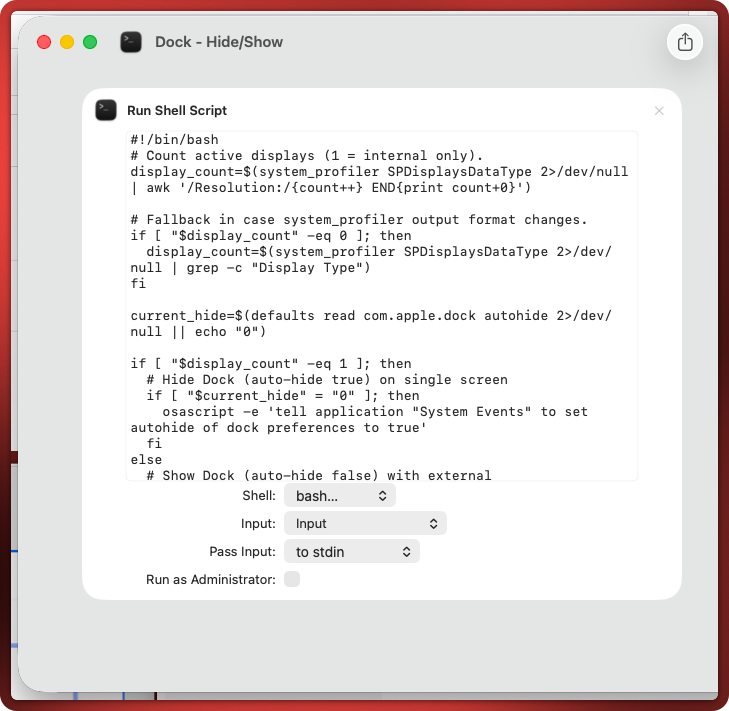
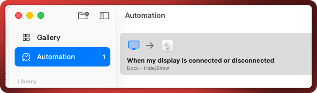

# Dock hide/show automation

When more than one display is connected, the dock will be visible. If only one (Laptop) the dock will auto-hide.

## Installation

### Shortcut

Create a shortcut with the contents of the bash-script

### Automation

Create automation that runs the script when a display is connected or disconnected

### System

You might need to allow AEServer to control your computer under System Settings > Privacy & Security > Accessibility
